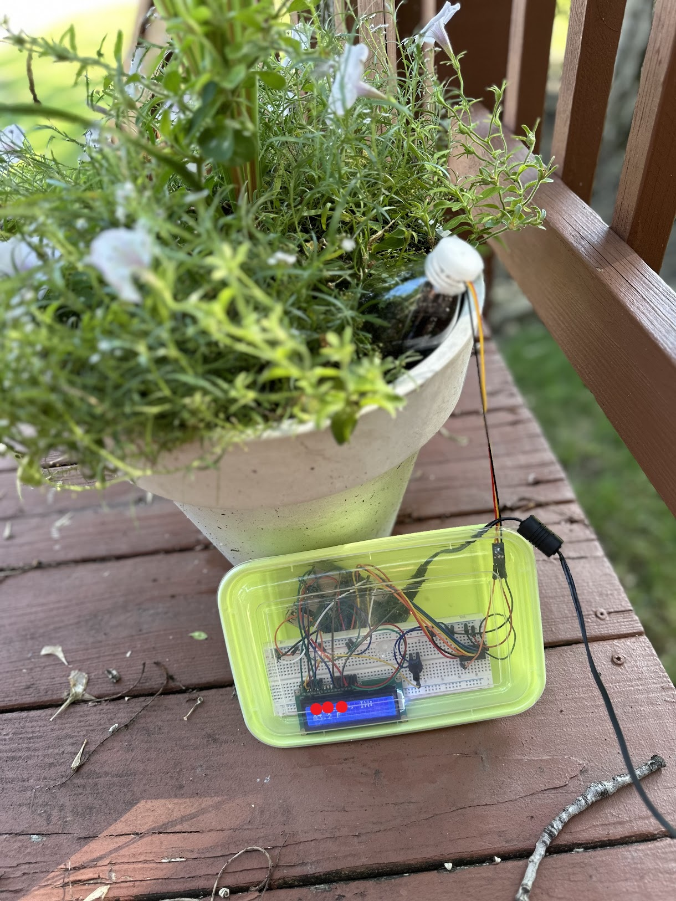

# Soil Moisture Monitoring System with Raspberry Pi

<div style="display: flex;">


</div>

This project uses a Raspberry Pi to monitor the soil moisture levels of a plant and sends email reports at regular intervals. The system runs a cron-job every two hours between 8am and 8pm to collect moisture data and generate reports.

## Features

- **Soil Moisture Detection**: Reads soil moisture levels from the sensor and calculates an average from 15 tests.
- **Email Notifications**: Automatically sends an email report to a specified email list with the current moisture levels.
- **Scheduled Execution**: Runs via cron-job every two hours, starting from 8am to 8pm.

## Setup

### Prerequisites

- Raspberry Pi (with Python installed)
- Moisture sensor connected to the Raspberry Pi
- Email credentials for sending reports

### Installation

1. **Clone the Repository:**

   ```bash
   git clone https://github.com/Griffinov22/soil_moisture_python.git
   cd soil_moisture_python
   ```

2. **Install Dependencies:**
   Install the necessary Python libraries:

   ```bash
   pip install -r requirements.txt
   ```

3. **Configure the Email Script:**
   Update the `garden_email.py` file with your email credentials (SMTP configuration) and the email list of recipients. This will allow the script to send the reports via email.

4. **Set Up the Cron Job:**
   To automate the script, edit the cron table using the following command:

   ```bash
   crontab -e
   ```

   Add this line to schedule the script to run every two hours between 8am and 8pm:

   ```bash
   0 8-20/2 * * * /path/to/soil-moisture.bash
   ```

5. **Running the Script Manually (Optional):**
   You can also run the script manually to test if everything is working:
   ```bash
   python moisture_monitor.py
   ```

## Example Email Report

The email contains the average moisture level from the tests conducted over the two-hour period. Below is an example of the email format:


## Post Creation Thoughts

I want to be able to take my raspbery pi completely off the grid. Right now the pi has to be plugged in, so it is limited to length of it's power cord. I am looking into solar chargers that would suit the power needs of the raspberry pi I am using.
